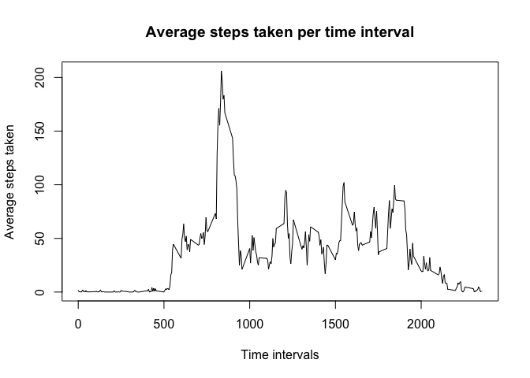

# Reproducible Research: Peer Assessment 1

Todo: background and target for this document

## Loading and preprocessing the data

Dplyr package will be used for efficient data frame modifications.  
Analysis uses the activity monitoring dataset.


```r
    library(dplyr)
```

```
## 
## Attaching package: 'dplyr'
## 
## The following objects are masked from 'package:stats':
## 
##     filter, lag
## 
## The following objects are masked from 'package:base':
## 
##     intersect, setdiff, setequal, union
```

```r
    data <- read.csv("activity.csv")
    ## TODO: Data processing
```

## What is mean total number of steps taken per day?

We start analysis by calculating mean and median of total steps per day. We also display histogram of total steps per day.

Following code uses loaded activity dataset, calculates total steps per day and displays histogram.


```r
    ## Create table showing steps per day and calculate total
    date_data = group_by(data, date)
    steps_per_day <- summarise(date_data, total = sum(steps))
    
    ## print histogram showing steps per day
    hist (steps_per_day$total, main="Histogram of total steps per day", xlab = "Total steps per day")
```

 

Next we calculate mean and median for total steps per day.

```r
    ## Calculate mean
    mean <- mean(steps_per_day$total, na.rm = TRUE)
    sprintf("Mean steps per day: %s", mean)
```

```
## [1] "Mean steps per day: 10766.1886792453"
```

```r
    ## Calculate median
    median <- median(steps_per_day$total, na.rm = TRUE)
    sprintf("Median steps per day: %s", median)
```

```
## [1] "Median steps per day: 10765"
```


## What is the average daily activity pattern?

Next we calculate average steps per intervals and find time interval with highest average.

Following code calculates average steps per time interval and displays it as line plot.


```r
    ## Create table showing steps per interval
    interval_data = group_by(data, interval)
    average_per_interval <- summarise(interval_data, average = mean(steps, na.rm = TRUE))
    
    ## create plot
    plot(average_per_interval$interval, average_per_interval$average, type = "l", xlab = "Time intervals", 
         ylab = "Steps taken", main = "Average steps taken per time interval")
```

 

Next we find the time interval with highest average steps.


```r
    ## Find highest average time interval
    max_avg <- max(average_per_interval[,2])
    max_int <- average_per_interval[average_per_interval$average == max_avg, "interval"]
    sprintf("Interval containing highest average steps is: %s", max_int)
```

```
## [1] "Interval containing highest average steps is: 835"
```

## Imputing missing values


## Are there differences in activity patterns between weekdays and weekends?
